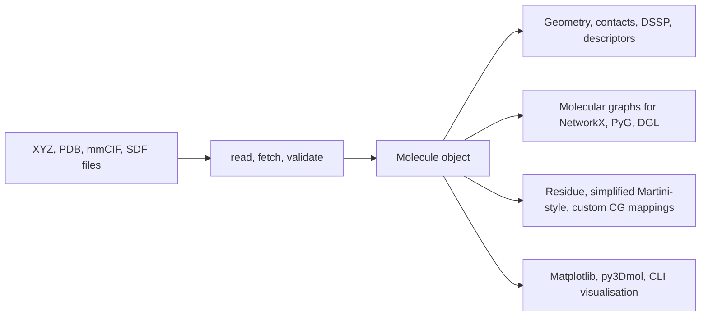

# MolScope

[](https://github.com/roshan2004/molscope/actions/workflows/ci.yml)
[](https://roshan2004.github.io/molscope/)
[](https://pypi.org/project/molscope/)
[](pyproject.toml)
[](LICENSE)
[](https://github.com/astral-sh/ruff)

Lightweight molecular structure analysis, visualisation, graph export, and
coarse-graining in Python. Read `.xyz`, `.pdb`, `.cif` and `.sdf` files
(optionally gzip-compressed), select and analyse atoms, and visualise them in
3D. The `.cif` reader handles standard `_atom_site` coordinate loops, including
quoted values; optional Gemmi-backed validation is available through
`pip install "molscope[cif]"`.

MolScope is a small scientific Python toolkit for turning molecular coordinate
files into inspectable structures, descriptors, ML-ready graphs, and
coarse-grained bead models without pulling in a full simulation stack.

| 3D structure (element) | Secondary structure (DSSP) | Residue contact map | Coarse-grained beads |
| --- | --- | --- | --- |
|  |  |  |  |

## Who is this for?

- Students learning molecular-coordinate formats, structure analysis, and basic
  visualisation from readable Python code.
- Molecular modellers who want quick static-structure checks, selections,
  contact maps, and lightweight coarse-grained mapping prototypes.
- ML-for-molecules learners who need deterministic descriptors and graph exports
  before moving to larger chemistry or simulation frameworks.

## What it does

- **Read and write** XYZ, PDB, mmCIF and SDF (gzip-aware), preserve SDF/PDB
  explicit bonds and SDF formal charges where present, fetch structures by id
  from RCSB, and load multi-model NMR ensembles.
- **Validate mmCIF** syntax, atom-site coordinate columns, and supplied
  dictionary files with optional Gemmi support.
- **Select and measure** by chain, element or residue; compute distances,
  angles, dihedrals and Kabsch-aligned RMSD.
- **Analyse** centroids, radius of gyration, the inertia tensor,
  explicit/inferred bonds, and contacts.
- **Contact maps** at atom or residue level, with heatmap plots, sequence-
  separation and chain filtering, and contact-order metrics.
- **Secondary structure** via a self-contained, dependency-free DSSP, with
  element/segment extraction, per-chain breakdown, backbone phi/psi/omega
  torsions, and `plot(color_by="ss")`.
- **Protein interfaces and binding sites**: inter-chain interface residues,
  chain-chain contact counts, and ligand-binding-site residues (ATOM/HETATM
  aware).
- **Ensembles**: pairwise RMSD, RMSF, averaging, and conformer clustering.
- **Export for ML**: flat structural descriptors and molecular graphs for
  NetworkX, PyTorch Geometric and DGL.
- **Chemical perception and descriptors**: optional RDKit-backed formal charge,
  valence, aromaticity and scalar descriptor features with
  `pip install "molscope[chem]"`.
- **Coarse-grain** onto residue, Martini-style or custom bead mappings.
- **Visualise** with 3D matplotlib plots, an interactive py3Dmol viewer, spin
  GIFs, and a command-line interface.

## Architecture



## Why MolScope?

MolScope takes you from a structure file to analysis, a machine-learning graph,
or a coarse-grained model with the smallest install that gets the job done. The
core depends only on NumPy and Matplotlib, so `pip install molscope` stays light.
Everything heavier (RDKit, PyTorch, PyTorch Geometric, DGL, MDAnalysis, Gemmi)
is an opt-in [extra](#install) you add only when you reach for it.

That makes it an on-ramp rather than a framework:

- **Structure to ML graph in a few lines.** `mol.to_graph()` runs with zero extra
  dependencies; `mol.to_pyg_data()`, `mol.to_networkx()` and `mol.to_dgl_graph()`
  hand off to the ecosystem when you want it. This is the path MolScope is built
  to make easy.
- **Light enough to teach and prototype with.** A readable, Python-first API over
  static structures, with no trajectory engine or build step to wrestle.
- **Honest about its numbers.** Bonds, geometry and DSSP are cross-checked against
  reference tools (MDAnalysis, `mkdssp`) in CI, so you know where the results come
  from.

MolScope is **not** a replacement for full molecular-simulation or
cheminformatics frameworks. In particular, the coarse-graining tools are for
**educational CG mapping and bead-graph prototyping**: useful for exploring
mappings before moving to a production Martini workflow, not a validated Martini
force-field generator.

| Tool | Main focus | How MolScope differs |
| --- | --- | --- |
| RDKit | Cheminformatics | MolScope leans toward structure visualisation, protein/PDB-style metadata, and CG prototyping |
| MDAnalysis | MD trajectories | MolScope is lighter and easier for static structures and teaching |
| MDTraj | Trajectory analysis | MolScope is simpler and graph/CG oriented |
| Biopython | Structure parsing / bioinformatics | MolScope adds 3D analysis, ML-graph export, and coarse-graining |
| PyMOL / VMD | Interactive visualisation | MolScope is Python-first, scriptable, and ML-export friendly |
| nglview | Notebook structure viewer | MolScope also does analysis, descriptors, graphs and CG, not just viewing |

Reach for those tools when you need their depth and validation. Reach for
MolScope when you want the shortest path from a structure file to analysis, an
ML graph, or a CG prototype.

## Install

With [uv](https://docs.astral.sh/uv/) (recommended):

```bash
uv sync                     # creates .venv, installs deps + dev tools from the lockfile
uv run molscope examples/data/1fqy.pdb  # run the CLI
uv run pytest               # run the tests
```

`uv sync` pins the interpreter from `.python-version` and resolves against
`uv.lock` for reproducible installs. Use `uv sync --no-dev` to skip the test tools.

With plain pip:

```bash
pip install molscope

# for local development from this checkout:
python -m venv .venv && source .venv/bin/activate
pip install -e ".[test]"    # or: pip install -r requirements.txt
```

## Documentation

The documentation website is built with MkDocs Material:

```bash
uv sync --group docs
uv run mkdocs serve
python scripts/build_user_guide_pdf.py
```

Docs source lives in `docs/`; the site configuration is `mkdocs.yml`. The PDF
builder requires Pandoc and a LaTeX engine such as `xelatex`.

Scientific validation is documented in
[`docs/validation.md`](docs/validation.md): reference tools, assumptions,
failure modes, and tolerances for MDAnalysis, RDKit, `mkdssp`, and invariant
checks.

## Quickstart

A runnable end-to-end tour over the bundled sample structures lives in
[`examples/tour.py`](examples/tour.py):

```bash
uv run python examples/tour.py                  # opens 3D plot windows
MPLBACKEND=Agg uv run python examples/tour.py   # headless: saves PNGs instead
```

It reads an `.xyz` and a `.pdb`, prints derived properties, compares the NMR
models of `1aml`, writes a transformed structure back out, and renders a plot.

For a focused workflow, see
[`docs/examples/pdb-to-graph-cg.md`](docs/examples/pdb-to-graph-cg.md):
from PDB to molecular graph and coarse-grained beads in about 10 minutes.
For an ML-oriented walkthrough, see
[`docs/examples/pdb-to-pyg-ml.md`](docs/examples/pdb-to-pyg-ml.md):
PDB ensemble to PyTorch Geometric classifier/regressor toy model.
For coarse-graining as a teaching workflow, run
[`examples/coarse_graining.py`](examples/coarse_graining.py): residue
centre-of-mass beads, residue centroids, and a simplified backbone/sidechain
mapping with a visual atomistic-to-CG comparison.

For protein-coordinate analysis from scratch, see
[`docs/examples/protein-analysis-from-scratch.md`](docs/examples/protein-analysis-from-scratch.md)
and [`notebooks/protein_analysis_from_scratch.ipynb`](notebooks/protein_analysis_from_scratch.ipynb):
backbone atoms, residues, chains, alpha carbons, contact maps, NMR ensemble
contacts, ligands, waters, binding sites, and simplified DSSP.

For a runnable, narrated version of that ML walkthrough, open the notebook
[`notebooks/pdb_to_gnn.ipynb`](notebooks/pdb_to_gnn.ipynb): structure file to a
trained GNN, end to end (needs `pip install 'molscope[pyg]'`).

## Library

```python
import molscope as ms

mol = ms.read("examples/data/1fqy.pdb")  # parser chosen from the extension
mol = ms.fetch("1fqy")             # ...or download straight from RCSB by id
print(mol.summary())                # atoms, formula, chains, bounding box

mol = mol.centered().rotate("z", 90).translate((1, 2, -1))
mol.plot()                          # CPK colours, inferred bonds, equal aspect
```

`Molecule` is immutable: `translate`, `centered` and `rotate` each return a new
molecule, so transformations chain cleanly without aliasing. Equality is by
value (`np.array_equal` on coordinates).

### Selections

PDB files, and standard mmCIF atom-site loops, carry per-atom metadata (atom
name, residue, chain), so you can slice a structure:

```python
mol.select(chain="A")               # one chain
mol.select(element="C")             # all carbons
mol.select(resname="HOH")           # waters
mol.select(resid=(10, 20))          # an inclusive residue range
mol.alpha_carbons()                 # CA atoms (the usual basis for protein RMSD)
mol.backbone()                      # N, CA, C, O
mol[mask_or_indices]                # subset by numpy mask / index array
```

### Analysis and measurements

```python
mol.centroid, mol.center_of_mass    # geometric / mass-weighted centre
mol.radius_of_gyration              # compactness (angstrom)
mol.dimensions, mol.formula         # bounding box, Hill-order formula
mol.distance_matrix()               # dense pairwise matrix (NumPy, Torch, CuPy)
mol.bonds()                         # inferred bond index pairs (KD-tree if scipy)
mol.contacts(cutoff=5.0)            # atom pairs within a distance
mol.contact_count(cutoff=5.0)       # count pairs without returning them

mol.distance(i, j)                  # bond length
mol.angle(i, j, k)                  # bond angle (degrees)
mol.dihedral(a, b, c, d)            # torsion angle (degrees)

a.alpha_carbons().rmsd(b.alpha_carbons(), align=True)   # CA-RMSD after Kabsch fit
```

### Structural descriptors for ML

```python
features = mol.descriptors()                 # flat dict of scalar/vector descriptors
features = mol.descriptors(preset="native-3d")
features["radius_of_gyration"]
features["principal_moments"]                # 3 values
features["distance_histogram"]               # fixed-size histogram

X, names = ms.featurize_many(
    ["a.pdb", "b.pdb", "c.xyz"],
    preset="native-basic",
    return_names=True,
)                                            # numeric matrix + column names
```

Descriptors include atom/residue counts, element counts, molecular mass,
centres, radius of gyration, bounding-box dimensions, inertia tensor, principal
moments/axes, shape anisotropy, compactness, distance histograms, bond-length
summary statistics, and atom/residue contact summaries. Full contact maps remain
available through `mol.contact_map(...)`. With `pip install "molscope[chem]"`,
you can also request RDKit descriptors directly:

```python
mol.rdkit_descriptors(names=["MolWt", "TPSA"])
mol.descriptors(include_rdkit=True, rdkit_descriptor_names=["MolWt", "TPSA"])
```

For reproducible ML columns, use descriptor presets: `native-basic`,
`native-3d`, or `rdkit-basic`. Inspect the flattened column order with
`ms.descriptor_feature_names(...)`.

### Contact maps

```python
cmap = mol.contact_map(cutoff=8.0, level="residue")   # CA-CA contacts -> ContactMap
cmap.matrix                                           # (R, R) array
mol.plot_contact_map(cutoff=8.0)                      # heatmap

mol.contact_map(level="atom")                         # atom-level map
mol.contact_map(level="residue", method="min")        # closest inter-residue atom
mol.contact_map(level="residue", method="com")        # residue centre of mass
mol.contact_map(level="residue", backend="torch", device="cuda")  # optional GPU
```

### Secondary structure (DSSP)

Assign protein secondary structure from backbone hydrogen-bond patterns with a
self-contained, pure-NumPy, **simplified DSSP-style** implementation (no
external `mkdssp` binary needed):

```python
mol = ms.read("examples/data/1fqy.pdb")
ss = mol.secondary_structure()      # SecondaryStructure, one code per residue

ss.string                           # e.g. '--HHHHHHHH--SS--EEEE--'
ss.codes                            # per-residue array
ss.summary()                        # helix/strand/coil counts and fractions

mol.plot(color_by="ss")             # colour the 3D view by secondary structure
```

Codes follow DSSP notation: `H`/`G`/`I` helices, `E`/`B` strands, `T` turn, `S`
bend, `-` coil. This is a simplified **educational** implementation of the
Kabsch-Sander hydrogen-bond model: not bit-identical to the reference `mkdssp`
on every edge case, but validated against it. A CI cross-check
(`tests/validation`) puts it at **~99% per-residue 3-state agreement**
(helix/strand/coil) with `mkdssp` 4.2.2 on the bundled aquaporin (`1fqy`);
strand-rich folds, where reference DSSP is hardest to match, will agree less
closely. It needs backbone N/CA/C/O atoms, so use PDB/mmCIF input (not a bare
`.xyz`). The secondary-structure render in the showcase above (helices red,
turns cyan, coil grey) is produced this way.

### NMR ensembles

```python
from molscope import ensemble

models = ms.read_pdb_models("examples/data/1aml.pdb")     # all 20 models
ensemble.rmsd_matrix(models)                 # pairwise RMSD matrix
ensemble.rmsf(models)                        # per-atom fluctuation
ensemble.average(models)                     # mean structure
ensemble.align_all(models)                   # superpose every model onto the first

# Per-residue-pair contact probability across the ensemble (NMR variability)
freq = ms.ensemble_contact_frequency(models, cutoff=8.0)
freq.plot()                                  # heatmap of contact frequencies in [0, 1]
```

### Comparing and clustering conformers

Cluster an ensemble (NMR models, conformer sets, docking poses, MD snapshots) by
pairwise RMSD:

```python
matrix = ms.rmsd_matrix(models, align=True)        # (M, M) RMSD matrix
ms.plot_rmsd_heatmap(matrix)                        # heatmap

clusters = ms.cluster(models, method="hierarchical")   # data-driven cutoff
clusters = ms.cluster(models, n_clusters=3)            # ...or a fixed count
clusters.n_clusters                                  # how many clusters
clusters.groups()                                    # {cluster_id: [model indices]}
clusters.representatives()                            # {cluster_id: medoid model index}

ms.plot_rmsd_heatmap(matrix, order=clusters.order)  # reorder into diagonal blocks
```

### Writing and viewing

```python
ms.write_xyz(mol.centered(), "out.xyz")     # write transformed coordinates back
ms.write_pdb(mol, "out.pdb")

mol.plot(color_by="chain")                   # colour by element / chain / residue
mol.view(style="cartoon")                    # interactive py3Dmol viewer (notebooks)
from molscope.plotting import spin_gif
spin_gif(mol, "spin.gif")                    # rotating animation
```

### Molecular graphs (for machine learning)

Turn 3D coordinates plus explicit or inferred bonds into a graph, then export
to the common ML frameworks. The base `to_graph()` needs no extra dependencies;
each exporter imports its backend lazily.

```python
mol = ms.read("examples/data/1fqy.pdb")

g = mol.to_graph()                  # MolecularGraph: nodes + edges, no deps
g.n_atoms, g.n_bonds                # counts
g.atomic_numbers, g.masses          # per-node arrays
g.node_features()                   # (N, 2) default features [atomic_number, mass]
g.node_features("ml")               # stable ML node preset
g.edge_features("ml")               # stable ML edge preset

G = mol.to_networkx()               # networkx.Graph with node/edge attributes
data = mol.to_pyg_data()            # torch_geometric.data.Data (x, pos, edge_index, edge_attr, z)
dglg = mol.to_dgl_graph()           # dgl.DGLGraph with ndata/edata tensors
```

Nodes carry element, atomic number, mass, coordinates, formal charge, and (from
PDB/mmCIF) atom name, residue and chain. Edges carry the bonded pair,
interatomic distance, and bond order from SDF where available (`1.0` for
PDB/CONECT or geometrically inferred bonds). Install backends as needed:
`pip install "molscope[graph]"` for NetworkX, `"molscope[pyg]"` for PyTorch
Geometric, `"molscope[dgl]"` for DGL, or `"molscope[gnn]"` for all graph
backends. For custom CUDA, ROCm, Apple Silicon, or cluster builds, install the
matching PyTorch stack first.

Graph feature presets are also available through
`mol.to_pyg_data(node_preset="ml", edge_preset="ml")` and
`mol.to_dgl_graph(node_preset="ml", edge_preset="ml")`. Use
`mol.to_graph(include_chemical_features=True)` to attach optional RDKit-backed
aromatic atom and bond flags.

For protein-scale spatial graphs, build a residue contact graph instead:

```python
rg = mol.to_residue_contact_graph(cutoff=8.0, method="ca", min_seq_sep=4)
RG = rg.to_networkx()
residue_data = rg.to_pyg_data(node_preset="ml", edge_preset="ml")
```

Use atom/bond graphs when covalent chemistry is the signal. Use residue or
bead contact graphs when 3D neighborhoods, interfaces, folded shape or
long-range contacts are the signal.

### Coarse-graining

Map an atomistic structure onto a smaller set of beads. The result is an
ordinary `Molecule` (beads as "atoms") with explicit CG bonds attached, so it
plots, transforms and graphs like anything else.

```python
mol = ms.read("examples/data/1fqy.pdb")

cg = mol.coarse_grain("residue_com")        # one bead per residue (centre of mass)
cg = mol.coarse_grain("residue_centroid")   # ...or geometric centroid
cg = mol.coarse_grain("martini")            # simplified backbone + side-chain beads
cg.plot(scale=200)                          # beads + backbone topology
print(cg.mapping_report())                  # explain beads, dropped atoms, and bonds

# Custom bead definitions by residue + atom name (needs PDB/mmCIF metadata)
mapping = {"ALA": {"BB": ["N", "CA", "C", "O"], "SC": ["CB"]}}
cg = mol.coarse_grain(mapping)
cg, report = mol.coarse_grain(mapping, return_report=True)

# Custom bead definitions by atom index (works on ANY structure, even .xyz)
cg = mol.coarse_grain({"head": [0, 1, 2, 3], "tail": [4, 5, 6, 7]},
                      bonds=[("head", "tail")])   # define the bead network too

cg.to_graph()                               # CG bead network, ready for ML
```

Visualise the mapping, inspect the per-bead assignment, and export it:

```python
ms.plot_mapping(mol, cg)                    # atoms coloured by bead, beads + bonds overlaid

report = cg.coarse_grain_report             # structured assignment
print(report.coverage())                    # "426 beads from 1661/1661 atoms"
print(report.beads[0].atom_indices)          # source atoms folded into bead 0

cg.write_mapping("mapping.json")            # round-trippable JSON record
record = ms.read_cg_mapping("mapping.json")
cg2 = ms.apply_cg_mapping(mol, record)      # rebuild on a matching structure
cg.write_index("mapping.ndx")               # GROMACS-style index, one group per bead
```

Bead positions are mass-weighted (or centroids). For residue mappings bonds are
generated automatically (within a residue, plus a backbone chain between
residues); pass `bonds=` to define them yourself. Name-based bonds are intended
for unique bead names such as `head`/`tail`; repeated names such as `BB`/`SC`
are ambiguous, so use bead indices for those. Atoms you leave unassigned are
dropped with a warning. The `"martini"` mapping teaches the idea of backbone and
sidechain beads; it does not assign Martini bead types, bonded/nonbonded
parameters, charges, exclusions, or simulation-engine topology files. This is
meant for teaching and prototyping CG mappings, not as a replacement for
production Martini preparation: the JSON and `.ndx` exports describe a bead
assignment for inspection and reuse, not a validated simulation topology.

## Command-line interface

MolScope provides a powerful CLI for visualization, batch analysis, and ML graph export.

### View (default)
Visualize a structure, apply transformations, and save images or animations.
```bash
molscope examples/data/1fqy.pdb --select atom_name=CA --color-by residue --save ca.png
molscope examples/data/1fqy.pdb --select "chain=A and atom_name=CA" --save chain-a-ca.png
molscope --fetch 1aml --center --gif amyloid.gif
```

### Analyze
Batch compute molecular descriptors for many files and save to a CSV table.
```bash
molscope analyze examples/data/*.pdb --out results.csv --preset native-3d --jobs 4
```

### Export
Batch export molecular graphs to PyTorch Geometric, DGL, or NetworkX formats.
```bash
molscope export "data/*.cif" --to pyg --out-dir pyg_graphs/ --pe laplacian --jobs 8
```
Supports advanced features like `--self-loops`, `--global-node`, and `--pe` (positional encodings).


## Sample structures

| File | Contents |
|------|----------|
| `examples/data/helix_201.xyz` | a helix (bare coordinates) |
| `examples/data/1fqy.pdb` | Aquaporin-1, single model (1661 atoms) |
| `examples/data/1aml.pdb` | Alzheimer amyloid A4 peptide, 20-model NMR ensemble |

## Notes

- PDB files are parsed by **fixed columns**, not whitespace splitting, so atoms
  with touching coordinate fields (large or negative values) read correctly.
- Alternate conformations (altLoc) other than the primary one are skipped.
  Use `read_pdb(..., altloc="first"|"highest_occupancy"|"all")` to select a
  different policy.
- `read_pdb` returns a single model (`model=1` by default); use `read_pdb_models`
  for the whole ensemble.
- SDF/MOL V2000 bond blocks, formal charges, and PDB `CONECT` records are
  preserved. PDB output writes explicit bonds back as `CONECT` records.
- Bond inference uses a `scipy.spatial.cKDTree` when available; without scipy it
  falls back to a dense `O(n^2)` search that is refused above ~8000 atoms.
- Optional extras: `pip install "molscope[fast]"` (scipy, faster bonds/contacts),
  `"molscope[viz]"` (py3Dmol, for `Molecule.view`), `"molscope[graph]"`
  (NetworkX), `"molscope[chem]"` (RDKit), `"molscope[cif]"` (Gemmi),
  `"molscope[gpu]"` (PyTorch dense distance/contact-map backend),
  `"molscope[pyg]"`, `"molscope[dgl]"`, or `"molscope[gnn]"`. For custom CUDA,
  ROCm, Apple Silicon, or cluster builds, install the matching PyTorch stack
  first.

## Tests and linting

```bash
uv run pytest                      # full test suite
uv run pytest tests/validation     # validation suite only
uv run ruff check .                # lint
```

CI (GitHub Actions) runs the suite and linting across Python 3.9 / 3.11 / 3.13,
smoke-imports the optional extras, and runs a separate **validation** job on
every push and PR. `tests/validation` is a two-tier suite: dependency-free
physical invariants (rigid-body algebra, geometry, coarse-grain conservation)
that run everywhere, plus cross-checks against reference scientific tools (the
simplified DSSP vs `mkdssp`) that turn "the tests pass" into a measured
agreement number.

## License

[MIT](LICENSE)
