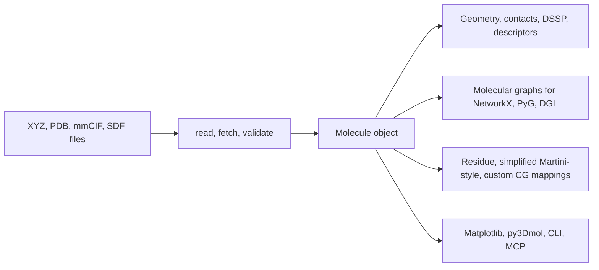

<p align="center">
  
</p>

<h1 align="center">MolScope</h1>

[](https://github.com/roshan2004/molscope/actions/workflows/ci.yml)
[](https://codecov.io/gh/roshan2004/molscope)
[](https://molscope.readthedocs.io/en/latest/)
[](https://pypi.org/project/molscope/)
[](pyproject.toml)
[](LICENSE)
[](https://github.com/astral-sh/ruff)
[](https://doi.org/10.5281/zenodo.20433850)

**A lightweight bridge from molecular structure files to descriptors, contact
maps, graph-ML inputs, and educational coarse-grained representations.**

Read `.xyz`, `.pdb`, `.cif`, or `.sdf`, analyse the structure, and turn it into a
descriptor table, a machine-learning graph, or a bead model. The core is just
NumPy and Matplotlib; heavy backends (RDKit, PyTorch Geometric, DGL, Gemmi) are
opt-in extras. Built for teaching, exploratory analysis, and ML-for-molecules
prototyping, not as a replacement for full simulation or cheminformatics stacks.

| 3D structure (element) | Secondary structure (DSSP) | Residue contact map | Coarse-grained beads |
| --- | --- | --- | --- |
|  |  |  |  |

## Quickstart

```bash
pip install molscope
```

```python
import molscope as ms

mol = ms.read("protein.pdb")     # or: ms.fetch("1fqy") to pull from RCSB
print(mol.summary())             # atoms, formula, chains, bounding box
graph = mol.to_graph()           # ML-ready molecular graph (no extra deps)
```

📖 **Documentation: <https://molscope.readthedocs.io>** — tutorials, the full
user guide, API reference, and scientific validation.

## Core workflows

| Workflow | Start here | Output |
| --- | --- | --- |
| **PDB to descriptors** | [`docs/tutorials/pdb-to-descriptors.md`](docs/tutorials/pdb-to-descriptors.md) | Fixed-width structural and optional RDKit-backed feature tables for screening, QC, and classical ML. |
| **PDB to graph/GNN** | [`docs/tutorials/pdb-to-graph-gnn.md`](docs/tutorials/pdb-to-graph-gnn.md) | Atom/bond, residue-contact, and PyTorch Geometric-ready graph data for message-passing experiments. |
| **PDB to coarse-grained beads** | [`docs/tutorials/pdb-to-coarse-grained-beads.md`](docs/tutorials/pdb-to-coarse-grained-beads.md) | Residue, simplified Martini-style, custom, and virtual-site bead models for inspection and graph prototyping. |

## Why MolScope?

MolScope takes you from a structure file to a descriptor table, a
machine-learning graph, or a coarse-grained model with the smallest install that
gets the job done. The core depends only on NumPy and Matplotlib, so
`pip install molscope` stays light. Everything heavier (RDKit, PyTorch, PyTorch
Geometric, DGL, MDAnalysis, Gemmi) is an opt-in [extra](#install) you add only
when one of those workflows needs it.

It is an on-ramp rather than a framework: a readable, Python-first API over
static structures, with no trajectory engine or build step to wrestle. MolScope
is **not** a replacement for full molecular-simulation or cheminformatics
frameworks. In particular, the coarse-graining tools are for **educational CG
mapping and bead-graph prototyping**, not a validated Martini force-field
generator.

| Tool | Main focus | How MolScope differs |
| --- | --- | --- |
| RDKit | Cheminformatics | MolScope leans toward structure visualisation, protein/PDB-style metadata, and CG prototyping |
| MDAnalysis | MD trajectories | MolScope is lighter and easier for static structures and teaching |
| MDTraj | Trajectory analysis | MolScope is simpler and graph/CG oriented |
| Biopython | Structure parsing / bioinformatics | MolScope adds 3D analysis, ML-graph export, and coarse-graining |
| PyMOL / VMD | Interactive visualisation | MolScope is Python-first, scriptable, and ML-export friendly |

Reach for those tools when you need their depth and validation. Reach for
MolScope when you want the shortest path from a structure file to analysis, an
ML graph, or a CG prototype.

## Install

With [uv](https://docs.astral.sh/uv/) (recommended):

```bash
uv sync                     # creates .venv, installs deps + dev tools from the lockfile
uv run molscope examples/data/1fqy.pdb  # run the CLI
uv run pytest               # run the tests
```

`uv sync` pins the interpreter from `.python-version` and resolves against
`uv.lock` for reproducible installs. Use `uv sync --no-dev` to skip the test tools.

With plain pip:

```bash
pip install molscope

# for local development from this checkout:
python -m venv .venv && source .venv/bin/activate
pip install -e ".[test]"    # or: pip install -r requirements.txt
```

Optional extras: `fast` (scipy, faster bonds/contacts), `viz` (py3Dmol),
`graph` (NetworkX), `chem` (RDKit), `cif` (Gemmi), `gpu` (Torch distance
backend), `pyg`, `dgl`, `gnn` (all graph backends), `xlsx` (openpyxl tables),
and `mcp` (the MCP server, Python >= 3.10).

## Library

```python
import molscope as ms

mol = ms.read("examples/data/1fqy.pdb")   # or ms.fetch("1fqy")
ca = mol.select(chain="A").alpha_carbons()  # metadata selections
cmap = mol.contact_map(cutoff=8.0)          # residue contact map
data = mol.to_pyg_data()                    # PyTorch Geometric graph
cg = mol.coarse_grain("residue_com")        # one bead per residue
```

`Molecule` is immutable: `translate`, `centered` and `rotate` each return a new
molecule, so transformations chain cleanly. Each capability has a focused
user-guide page:

| Capability | Guide |
| --- | --- |
| Read/write XYZ, PDB, mmCIF, SDF; fetch from RCSB; build from SMILES | [Reading files](docs/user-guide/reading-files.md) |
| Select atoms by metadata | [Selections](docs/user-guide/selections.md) |
| Geometry, RMSD, measurements | [Geometry and measurements](docs/user-guide/geometry.md) |
| Contact maps and distance matrices | [Contact maps](docs/user-guide/contact-maps.md) |
| DSSP, torsions, interfaces, binding sites | [Protein analysis](docs/user-guide/protein-analysis.md) |
| Native and RDKit descriptors | [Structural descriptors](docs/user-guide/descriptors.md) |
| Chemical perception, protein template bonds | [Chemical perception](docs/user-guide/chemical-perception.md) |
| Atom/bond and residue-contact graphs for ML | [Molecular graphs](docs/user-guide/molecular-graphs.md) |
| Coarse-grained bead mappings | [Coarse-graining](docs/user-guide/coarse-graining.md) |
| NMR ensembles and clustering | [Ensemble analysis](docs/user-guide/ensembles.md) |
| Plotting and py3Dmol viewing | [Plotting and viewing](docs/user-guide/plotting.md) |
| Diverse selection from a CSV/XLSX table | [Diverse selection](docs/user-guide/library-selection.md) |

## Command-line interface

MolScope provides a CLI for visualization, binding-site tables, batch analysis,
ML graph export, and diverse subset selection.

### View (default)
Visualize a structure, apply transformations, and save images or animations.
```bash
molscope examples/data/1fqy.pdb --select atom_name=CA --color-by residue --save ca.png
molscope examples/data/1fqy.pdb --select "chain=A and atom_name=CA" --save chain-a-ca.png
molscope --fetch 1aml --center --gif amyloid.gif
```

### Analyze
Batch compute molecular descriptors for many files and save to a CSV table.
```bash
molscope analyze examples/data/*.pdb --out results.csv --preset native-3d --jobs 4
```

### Binding sites
Write protein-ligand binding-site residue contacts and optional pocket
descriptors to CSV.
```bash
molscope binding-site examples/data/3ptb.pdb --out site.csv --cutoff 4.5
molscope binding-site examples/data/3ptb.pdb --out site.csv --descriptors-out pocket.csv
```

### Export
Batch export molecular graphs to PyTorch Geometric, DGL, or NetworkX formats.
```bash
molscope export "data/*.cif" --to pyg --out-dir pyg_graphs/ --pe laplacian --jobs 8
```
Supports advanced features like `--self-loops`, `--global-node`, and `--pe` (positional encodings).

### Select
Pick a diverse subset from a molecule table (`.csv` or `.xlsx`) by MaxMin
selection over descriptors. Select on existing numeric columns, or compute
descriptors from a SMILES column with RDKit.
```bash
molscope select molecules.csv --descriptor-cols MW ALogP -n 100 --out picked.csv
molscope select molecules.xlsx --smiles-col SMILES --compute-descriptors -n 100 --out picked.csv
```
`MolLogP` (RDKit's Crippen logP) is the ALogP equivalent.

## Use from an AI assistant (MCP)

MolScope ships an optional [Model Context Protocol](https://modelcontextprotocol.io)
server, so an AI assistant such as Claude Code or Claude Desktop can drive its
analyses in natural language. The server exposes MolScope's existing features as
MCP tools; it adds no new science, just an adapter layer over the public API.

```bash
pip install "molscope[mcp]"             # needs Python >= 3.10
claude mcp add molscope -- molscope-mcp  # register with Claude Code
```

It provides 21 read-only tools spanning most of the package (structure summary
and geometry, RMSD and ensembles, descriptors and chemistry, protein analysis,
coarse-graining, diverse selection, and PNG plots). For example, you can ask the
assistant to *"fetch trypsin (3ptb), find the benzamidine binding-site residues,
and render a contact map"*. See
[`docs/user-guide/mcp-server.md`](docs/user-guide/mcp-server.md) for the full
tool reference.

## Tutorials and examples

For polished, focused workflows, start with the tutorials:
[`PDB to descriptors`](docs/tutorials/pdb-to-descriptors.md),
[`PDB to graph/GNN`](docs/tutorials/pdb-to-graph-gnn.md), and
[`PDB to coarse-grained beads`](docs/tutorials/pdb-to-coarse-grained-beads.md).

A runnable end-to-end tour over the bundled sample structures lives in
[`examples/tour.py`](examples/tour.py) (use `MPLBACKEND=Agg` for headless PNGs).
For narrated notebooks, see
[`notebooks/protein_analysis_from_scratch.ipynb`](notebooks/protein_analysis_from_scratch.ipynb)
and [`notebooks/pdb_to_gnn.ipynb`](notebooks/pdb_to_gnn.ipynb) (structure file to
a trained GNN, needs `pip install 'molscope[pyg]'`).

## Scientific validation

MolScope is explicit about which results are cross-checked against reference
tools and which are intentionally lightweight:

| Feature | Status |
| --- | --- |
| Geometry, RMSD, contact maps | Cross-checked vs MDAnalysis (near machine precision) |
| Bond perception, chemical features | Cross-checked vs RDKit |
| Secondary structure (simplified DSSP) | Cross-checked vs `mkdssp`: ~98 to 99% 3-state agreement across helical, mixed, and all-beta folds |
| Protein template bonds | Cross-checked vs known per-residue chemistry |
| Native descriptors, molecular graphs | Deterministic; not benchmarked against a curated library |
| Coarse-graining | Mapping and visualisation only; **not** a validated force-field model |
| Standard protonation | Idealised pH-7 textbook model; **not** pKa-aware |

Methods, tolerances, assumptions and failure modes are documented in
[`docs/validation.md`](docs/validation.md). The CI **validation** job runs
dependency-free physical invariants plus these reference cross-checks on every
push and PR.

## Architecture



## Sample structures

| File | Contents |
|------|----------|
| `examples/data/helix_201.xyz` | a helix (bare coordinates) |
| `examples/data/1fqy.pdb` | Aquaporin-1, single model (1661 atoms) |
| `examples/data/1aml.pdb` | Alzheimer amyloid A4 peptide, 20-model NMR ensemble |
| `examples/data/3ptb.pdb` | Trypsin-benzamidine complex, ligand-binding-site example |

## Notes

- PDB files are parsed by **fixed columns**, not whitespace splitting, so atoms
  with touching coordinate fields (large or negative values) read correctly.
- Alternate conformations (altLoc) other than the primary one are skipped.
  Use `read_pdb(..., altloc="first"|"highest_occupancy"|"all")` to select a
  different policy.
- `read_pdb` returns a single model (`model=1` by default); use `read_pdb_models`
  for the whole ensemble.
- SDF/MOL V2000 bond blocks, formal charges, and PDB `CONECT` records are
  preserved. PDB output writes explicit bonds back as `CONECT` records.
- Bond inference uses a `scipy.spatial.cKDTree` when available; without scipy it
  falls back to a dense `O(n^2)` search that is refused above ~8000 atoms.

## Tests and linting

```bash
uv run pytest                      # full test suite
uv run pytest tests/validation     # validation suite only
uv run ruff check .                # lint
```

CI (GitHub Actions) runs the suite and linting across Python 3.9 / 3.11 / 3.13,
smoke-imports the optional extras, and runs a separate **validation** job on
every push and PR.

## Changelog

Notable changes for each release are recorded in [`CHANGELOG.md`](CHANGELOG.md),
following the [Keep a Changelog](https://keepachangelog.com/) format.

## How to cite

Each release of MolScope is archived on Zenodo with a citable DOI. The concept
DOI [10.5281/zenodo.20433850](https://doi.org/10.5281/zenodo.20433850) always
resolves to the latest version; each release also has its own version DOI.
Machine-readable citation metadata lives in [`CITATION.cff`](CITATION.cff), so
GitHub's "Cite this repository" button on the sidebar produces BibTeX and APA
entries automatically.

## License

[MIT](LICENSE)
