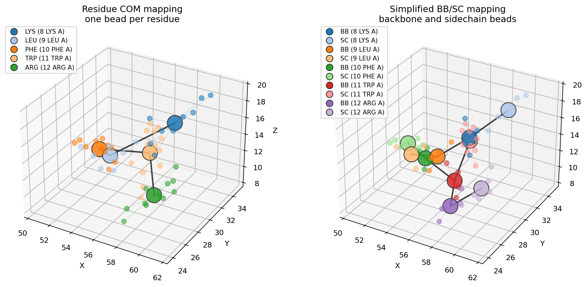

# Coarse-Grain A Protein

This example is for learning and inspection. It does not create production
simulation topologies or validated Martini parameters.

```python
import molscope as ms

mol = ms.read("examples/data/1fqy.pdb")

cg = mol.coarse_grain("residue_com")
print(cg.summary())
print(cg.mapping_report())

cg.plot(scale=200)
```

For a Martini-like teaching model:

```python
cg = mol.coarse_grain("martini")
G = cg.to_graph()
```

Conceptually, Martini-style coarse-graining groups atoms into interaction sites
such as backbone and sidechain beads. MolScope's `"martini"` mode only teaches
that mapping idea: it creates `BB`/`SC` bead coordinates and a simple bead graph.
Real Martini force fields additionally require validated bead types, bonded and
nonbonded parameters, charges, exclusions, and simulation-engine topology files.

## See the mapping

`plot_mapping` overlays the beads on the atoms they replace, colouring each atom
by its bead. A short fragment reads most clearly:

```python
fragment = mol.select(resid=(8, 12))
ms.plot_mapping(fragment, fragment.coarse_grain("martini"))
```

For a side-by-side residue COM vs backbone/sidechain visual:

```bash
uv run python examples/coarse_graining.py
```



## Inspect and export the assignment

```python
report = cg.coarse_grain_report
print(report.coverage())              # beads / atoms covered
print(report.beads[0].atom_indices)    # which atoms became bead 0

cg.write_mapping("mapping.json")      # JSON record (round-trippable)
cg.write_index("mapping.ndx")         # GROMACS-style index, one group per bead

record = ms.read_cg_mapping("mapping.json")
cg_again = ms.apply_cg_mapping(mol, record)   # rebuild on the same structure
```
