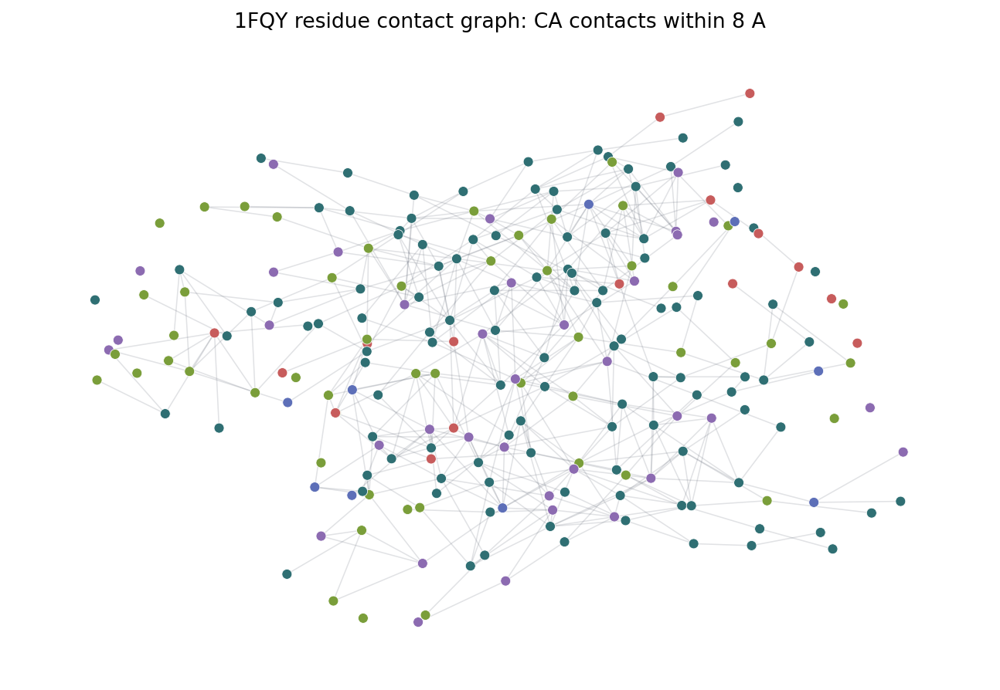

# Residue contact graphs

This example turns a PDB structure into a residue-level graph for structural ML.
Residues are nodes. Edges connect residues whose alpha carbons are within an
8 A cutoff after dropping local same-chain neighbors.

```python
import molscope as ms

mol = ms.read("examples/data/1fqy.pdb")
graph = mol.to_residue_contact_graph(cutoff=8.0, method="ca", min_seq_sep=4)

print(graph.n_residues, "residue nodes")
print(graph.n_contacts, "contact edges")
print(graph.node_features("ml").shape)
print(graph.edge_features("ml").shape)
```

For NetworkX:

```python
G = graph.to_networkx()
print(G.nodes[0])
print(next(iter(G.edges(data=True))))
```

For PyTorch Geometric:

```python
data = graph.to_pyg_data(node_preset="ml", edge_preset="ml")
print(data.x.shape, data.edge_index.shape, data.edge_attr.shape)
```



The runnable drawing script lives at `examples/residue_contact_graph.py`:

```bash
uv run python examples/residue_contact_graph.py
```
