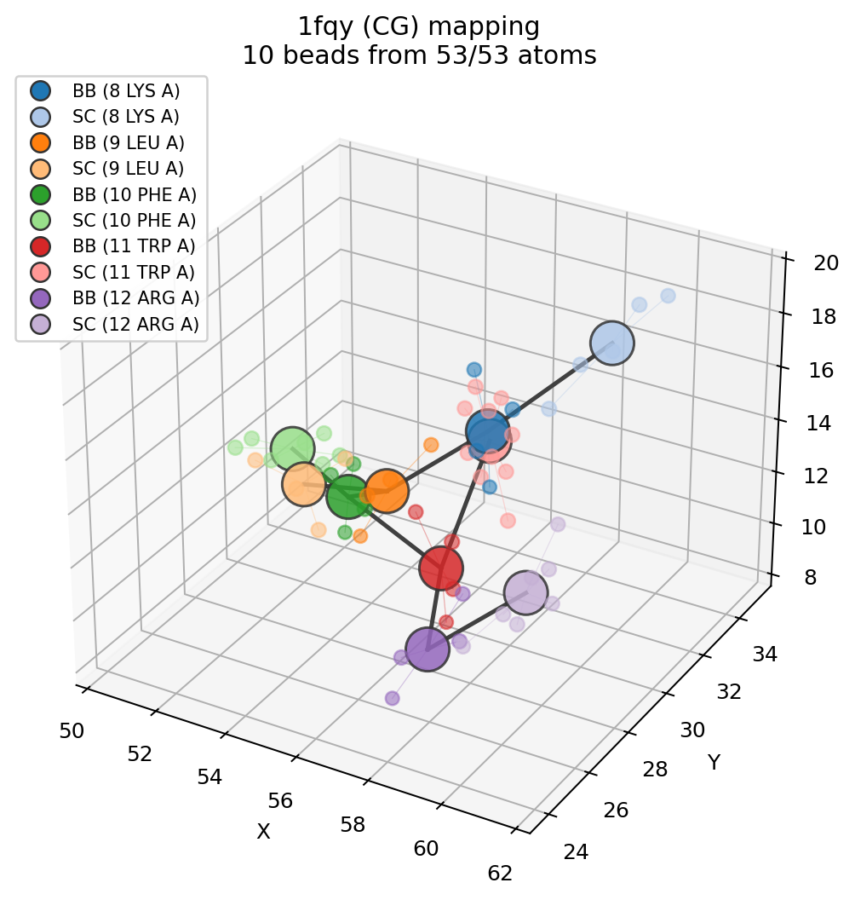

# Coarse-Graining

Coarse-graining maps an atomistic structure onto beads:

```python
cg = mol.coarse_grain("residue_com")
cg = mol.coarse_grain("residue_centroid")
cg = mol.coarse_grain("martini")
```

The result is still a `Molecule`, so it can be plotted, transformed, converted
to a graph, and analyzed.

## Custom residue mappings

```python
mapping = {"ALA": {"BB": ["N", "CA", "C", "O"], "SC": ["CB"]}}
cg = mol.coarse_grain(mapping)
```

## Custom index mappings

```python
cg = mol.coarse_grain(
    {"head": [0, 1, 2, 3], "tail": [4, 5, 6, 7]},
    bonds=[("head", "tail")],
)
```

Name-based bonds are intended for unique bead names. Repeated names such as
`BB` and `SC` are ambiguous across residues; use bead indices for those.

## Visualise the mapping

`plot_mapping` shows how the beads sit on top of the atoms they replace. Each
atom is coloured by the bead it was folded into, every bead is drawn as a large
translucent sphere at its position, thin lines join atoms to their bead, and the
CG bond network is drawn between beads. Atoms left unassigned appear as faint
grey crosses.

```python
import molscope as ms

fragment = ms.read("examples/data/1fqy.pdb").select(resid=(8, 12))
cg = fragment.coarse_grain("martini")

ms.plot_mapping(fragment, cg)     # or: cg.plot_mapping(fragment)
```



Pass the structure the CG model was built from (same atom order). The
atom-to-bead lines are drawn automatically for small structures; toggle them
with `show_assignment=True/False`, and the bead legend appears when there are
few enough beads to stay readable (`max_legend`).

## Inspect the bead assignment

Every coarse-grained `Molecule` carries a structured report describing exactly
which atoms went into each bead:

```python
cg = mol.coarse_grain("martini")
report = cg.coarse_grain_report

print(report.coverage())          # "426 beads from 1661/1661 atoms"
print(report.n_beads, report.n_assigned, report.n_dropped)

first = report.beads[0]
print(first.name, first.resname, first.resid, first.chain)
print(first.atom_indices)         # source-atom indices, in order
print(first.atom_names)           # ["N", "CA", "C", "O"]
print(first.reduction)            # "centre of mass"
```

`print(cg.mapping_report())` formats the whole thing as text (beads, dropped
atoms, and bonds), and `cg.coarse_grain("...", return_report=True)` returns the
`(molecule, report)` pair directly.

## Export and reload a mapping

Save the mapping to JSON, reload it, and re-apply it to a structure. Because the
record stores per-bead atom indices, repeated bead names such as `BB`/`SC`
round-trip cleanly:

```python
ms.write_cg_mapping(cg, "mapping.json")   # or: cg.write_mapping("mapping.json")

record = ms.read_cg_mapping("mapping.json")
cg2 = ms.apply_cg_mapping(mol, record)    # rebuild on the same (or matching) structure
```

`cg_mapping_to_dict(cg)` returns the same record as a plain `dict` without
touching disk. For inspection in tools that read index files, write a
GROMACS-style `.ndx` with one group per bead (1-based atom serials):

```python
ms.write_cg_index(cg, "mapping.ndx")      # or: cg.write_index("mapping.ndx")
```

The bead `Molecule` itself still writes as ordinary coordinates with its CG
bonds preserved:

```python
ms.write_pdb(cg, "beads.pdb")             # CONECT records carry the bead bonds
```

## Mapping reports

```python
cg = mol.coarse_grain("martini")
print(cg.mapping_report())

cg, report = mol.coarse_grain(mapping, return_report=True)
```

MolScope is useful for interpretable coarse-graining prototypes and teaching.
It is not a complete force-field engine with bonded, nonbonded, angle, dihedral,
charge, exclusion, or topology export parameter handling. The `.ndx` and JSON
exports describe a bead assignment for inspection and reuse; they are not
validated simulation topologies.
