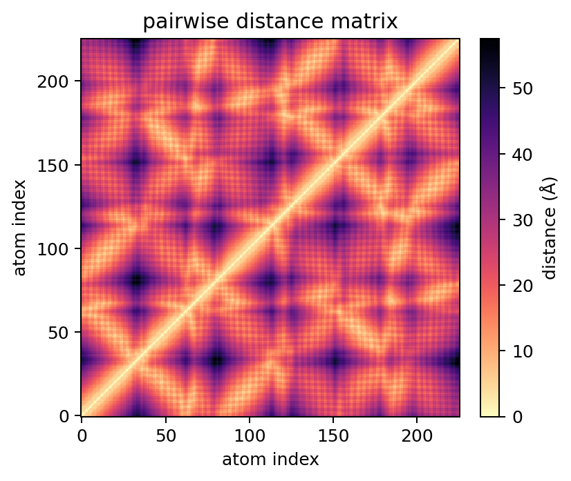
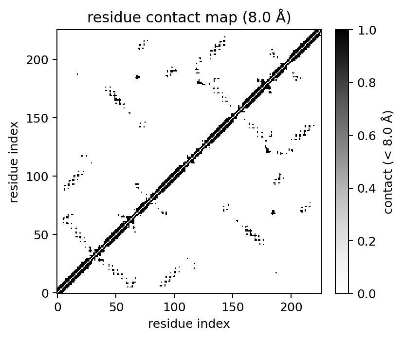
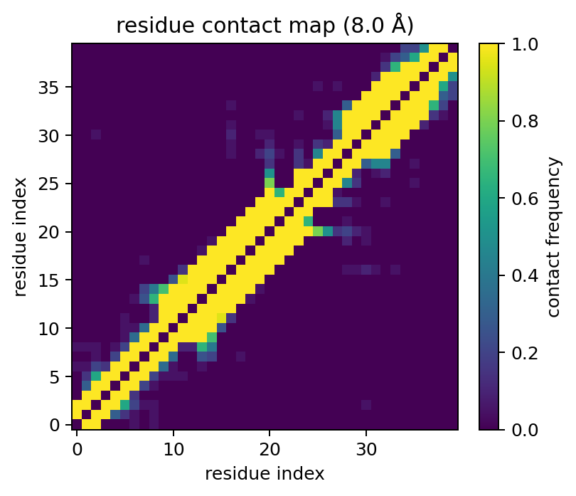

# Contact maps and distance matrices

Contact maps and dense distance matrices are MolScope's most direct structural
analysis tools. They are useful for checking folds, comparing ensembles,
building ML features, and validating coarse-grained mappings.

## Dense distance matrices

```python
import molscope as ms

mol = ms.read("examples/data/1fqy.pdb")
ca = mol.alpha_carbons()

D = ca.distance_matrix()                 # NumPy CPU backend
print(D.shape)                           # (226, 226)
ca.plot_distance_matrix(show=False)
```



By default, `distance_matrix()` returns a NumPy array. Optional dense backends
can be selected when you already have the corresponding array stack installed:

```python
D = ca.distance_matrix(backend="numpy")                  # CPU NumPy
D = ca.distance_matrix(backend="torch", device="cpu")    # PyTorch CPU
D = ca.distance_matrix(backend="torch", device="cuda")   # PyTorch CUDA
D = ca.distance_matrix(backend="cupy")                   # CuPy CUDA
D = ca.distance_matrix(backend="auto")                   # GPU if available
```

Results are converted back to NumPy by default so plotting and downstream
MolScope APIs keep working. Advanced users can keep a backend-native array:

```python
torch_matrix = ca.distance_matrix(backend="torch", device="cuda", as_numpy=False)
```

## Atom contacts

`contacts()` returns atom index pairs within a cutoff:

```python
pairs = mol.contacts(cutoff=5.0)
count = mol.contact_count(cutoff=5.0)
```

The default `contacts()` path uses SciPy's KD-tree when SciPy is installed and a
chunked NumPy fallback otherwise. Dense backends are also available:

```python
pairs = mol.contacts(cutoff=5.0, backend="numpy")
pairs = mol.contacts(cutoff=5.0, backend="torch", device="cuda")
```

Use dense backends when you already need a full matrix or want GPU acceleration
for moderate-sized structures. For sparse pair lists on large structures, the
KD-tree path is usually the better CPU choice.

## Residue contact maps

Residue contact maps summarize which residue pairs are closer than a cutoff:

```python
cmap = mol.contact_map(cutoff=8.0, level="residue", method="ca")
cmap.matrix
cmap.labels[:3]
cmap.plot(show=False)
```



Residue methods:

- `method="ca"`: alpha-carbon distance, with centroid fallback when CA is absent.
- `method="com"`: residue centre-of-mass distance.
- `method="min"`: closest inter-residue atom pair.

Dense backends apply to residue representative distances and atom-level contact
maps:

```python
cmap = mol.contact_map(cutoff=8.0, level="residue", backend="torch", device="cuda")
atom_map = mol.contact_map(cutoff=5.0, level="atom", backend="cupy")
```

## Ensemble contact frequency

For NMR ensembles or conformer sets, contact frequency reports how often each
pair is in contact:

```python
models = ms.read_pdb_models("examples/data/1aml.pdb")
freq = ms.ensemble_contact_frequency(models, cutoff=8.0)
freq.plot(show=False)
```



The matrix values are in `[0, 1]`, where `1.0` means a pair is in contact in
every model and intermediate values indicate conformational variability.

## Backend guidance

| Backend | Use when | Notes |
| --- | --- | --- |
| `numpy` | You want predictable CPU dense matrices | Always available |
| `scipy` | You want sparse atom contact pairs/counts on CPU | Default for `contacts()` when installed |
| `torch` | You already use PyTorch or want CUDA/MPS dense matrices | Install platform-specific PyTorch first |
| `cupy` | You already use CUDA CuPy arrays | Install the CUDA-matched CuPy package |
| `auto` | You want MolScope to pick GPU if available | Falls back to NumPy |

Dense matrices are `O(N^2)` memory. Prefer residue maps, alpha-carbon subsets,
or KD-tree contact pairs for large atomistic systems.
