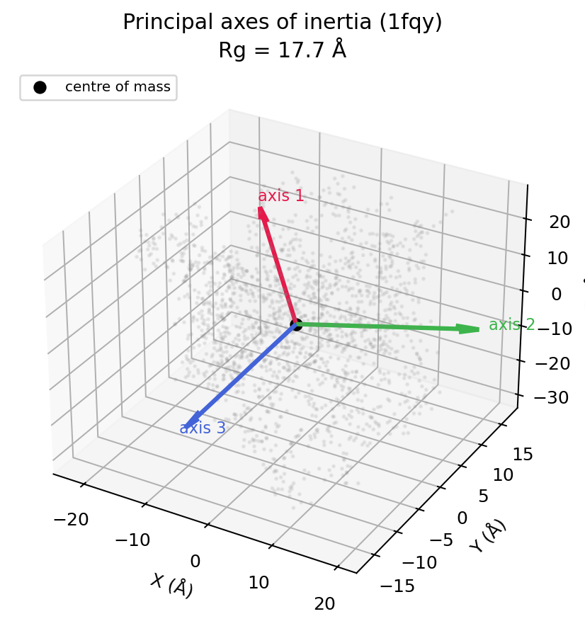
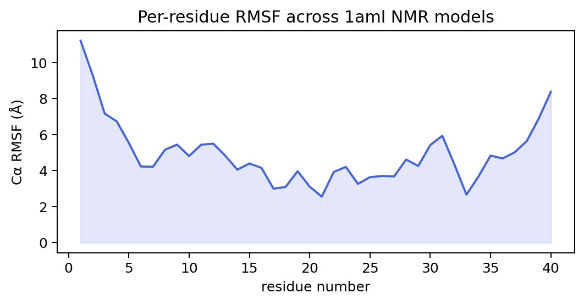

# Molecular geometry and measurements

Geometry is MolScope's core. Every quantity below is computed in readable NumPy
and is cross-checked against [MDAnalysis](https://www.mdanalysis.org/) in the
validation suite (`tests/validation/test_geometry_ref.py`). A runnable tour of
all of them lives in [`examples/geometry.py`](https://github.com/roshan2004/molscope/blob/main/examples/geometry.py).

```python
import molscope as ms

mol = ms.read("examples/data/1fqy.pdb")
```

## Distances, angles, dihedrals

The three local internal coordinates, all in one structure:

```python
mol.distance(i, j)          # |r_i - r_j|, in angstrom
mol.angle(i, j, k)          # angle at j, in degrees
mol.dihedral(a, b, c, d)    # torsion about the b-c bond, in degrees (-180, 180]
```

- **Distance** is the Euclidean norm of the difference vector.
- **Angle** at the central atom `j` comes from the dot product of the two bond
  vectors: `acos((u·v)/(|u||v|))`.
- **Dihedral** is the angle between the two planes sharing the `b-c` bond,
  computed with the numerically stable `atan2` formulation, so it carries the
  correct sign (the basis of backbone phi/psi torsions).

## Centroid vs centre of mass

Two notions of "the middle", and the difference matters:

```python
mol.centroid          # unweighted mean of positions
mol.center_of_mass    # mass-weighted: sum(m_i r_i) / sum(m_i)
```

The **centroid** treats every atom equally; the **centre of mass** pulls towards
heavy atoms. They coincide for a homonuclear system and drift apart when heavy
atoms sit off-centre. Centre on either with `mol.centered()` (centroid) or
`mol.centered(weighted=True)` (COM).

## Radius of gyration

A single number for overall size and compactness:

```python
mol.radius_of_gyration    # Rg, in angstrom
```

`Rg = sqrt(sum(m_i |r_i - R_com|^2) / sum(m_i))` is the mass-weighted RMS
distance of atoms from the centre of mass. It is small for globular structures
and grows as a chain extends or unfolds, which makes it a handy reaction
coordinate for folding and compaction.

## Inertia tensor and principal axes

How mass is distributed in space, i.e. the molecule's overall shape:

```python
mol.inertia_tensor()      # (3, 3) mass-weighted tensor about the COM
mol.principal_moments()   # (3,) eigenvalues, ascending
mol.principal_axes()      # (3, 3) eigenvectors as columns, moment-sorted
```

The inertia tensor is `I = sum_i m_i (|r_i|^2 I_3 - r_i r_i^T)` about the centre
of mass. Diagonalising it gives the **principal axes** (the natural body frame)
and the **principal moments** (how mass spreads along each axis). Equal moments
mean a spherical mass distribution; one small and two large moments mean a rod;
the ratios drive shape descriptors like asphericity.



## Kabsch alignment and RMSD

To compare two structures you must first remove rigid-body differences. The
**Kabsch algorithm** finds the rotation (via an SVD of the cross-covariance, with
a reflection correction) that best superposes one structure onto another:

```python
aligned = a.superpose(b)        # a optimally rotated/translated onto b
rmsd = a.rmsd(b, align=True)    # RMSD after that optimal fit
raw = a.rmsd(b)                 # RMSD as-is, no alignment
```

**RMSD** (root-mean-square deviation) is `sqrt(mean(|a_i - b_i|^2))` over matched
atoms. With `align=True` it is the minimum RMSD over all rigid orientations, the
standard measure of how similar two conformations are.

## Ensembles: RMSF and the RMSD matrix

Across a set of structures (an NMR ensemble, conformers, a trajectory), MolScope
summarises motion and spread:

```python
models = ms.read_pdb_models("examples/data/1aml.pdb")

ms.ensemble.rmsf(models)        # per-atom root-mean-square fluctuation
ms.rmsd_matrix(models)          # (M, M) pairwise RMSD between models
ms.ensemble.average(models)     # mean structure
```

**RMSF** (root-mean-square fluctuation) measures how much each atom moves about
its mean position after alignment, so it maps flexibility onto the sequence:
flexible loops and termini spike, the structured core stays low.



The pairwise **RMSD matrix** shows how the models relate to each other and feeds
conformer clustering (`ms.cluster`); plot it with `ms.plot_rmsd_heatmap`.

## Pairwise distances and contacts

```python
D = mol.distance_matrix()              # dense (N, N), NumPy by default
pairs = mol.contacts(cutoff=5.0)       # atom index pairs within a cutoff
```

`distance_matrix()` supports NumPy, PyTorch, CuPy, and `auto` backends; see
[Contact maps and distance matrices](contact-maps.md) for backends, images, and
benchmarks.
